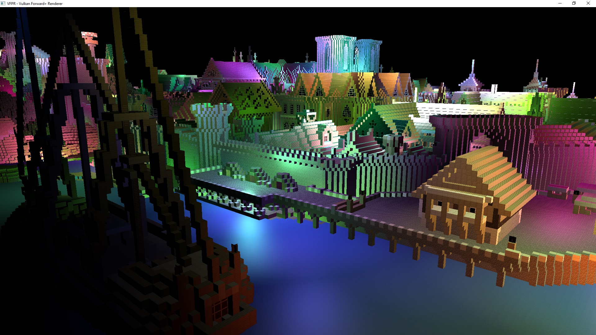
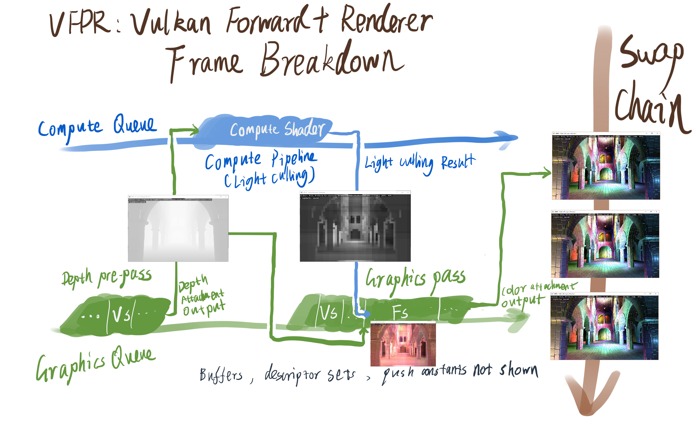

# VFPR - a Vulkan Forward Plus Renderer

**A final project for University of Pennsylvania, CIS 565: GPU Programming and Architecture**

We created a Forward+ (tiled forward) renderer in Vulkan using compute shader to deal with light culling. 

Our implementation is __~700%__ faster than regular forward renderer (tested in Vulkan) under the condition of 200 lights.

**Team Members**
* Ruoyu Fan
 * [Website](http://windy.moe/portfolio)
 * [LinkedIn](https://www.linkedin.com/in/ruoyuf)
 * [Github](https://github.com/WindyDarian)
* Xueyin Wan
 * [Website](http://xueyin.me/)
 * [Linkedin](https://www.linkedin.com/in/xueyin-wan)
 * [Github](https://github.com/xueyinw)
 
# Overview of Forward Plus Technique
Our ideas of this cool renderer are from this amazing paper: [Forward+: Bringing Deferred Lighting to the Next Level](https://takahiroharada.files.wordpress.com/2015/04/forward_plus.pdf). Thanks so much for the incredible authors!

Forward plus actually is an extension to traditional forward rendering. In forward rendering, it normally limits the number of lights to be valued when shading, which also limits the visibility computation. 

Forward plus extends the forward rendering pipeline by adding a light-culling stage before final shading. Basically this pipeline consists of three stages: depth prepass, light culling, and final shading. We will share more about these stages immediately combined with our Vulkan structure. The advantage of this method is that the scene could be rendered with many lights by culling, and storing only lights that contribute to the tile. Definitely a cool technique, right? :)

Now, let us introduces these three stages in the basic forward plus renderer. In our project, since we use Vulkan, we create three command buffers for each single step.

* Step 1: Depth Pre-pass

We inplemented this step by creating a pipeline without fragment shader in Vulkan. This enables depth-write and depth test.


As the picture above shows, this will output a depth map, which could be used as an input for light culling stage.
    
* Step 2: Light Culling

light culling calculates a list of light indices overlapping a tile. In our project, the default tile size is 16 * 16.

As we mentioned above, the depth map generated from the depth prepass stage is used to determine the minimum and maximum depth values within a tile, that is the minimum and maximum depths across the entire tile. 

It is noticable that in Vulkan, we add a compute shader for this stage between renderpass one (depth prepass) and renderpass two (final shading).

* Step 3: Light Accumulation and Final Shading

Lastly, we created another renderpass for final shading, which accumulates all the lights in the light list we calculated for each tile, then we do the final shading based on the results.
For loading more materials, we run the pipeline for each material group to enable the full scene of sponza.


 
TODO: video

| Render           | Heatmap          |
|------------------|------------------|
|  |  |

| Heatmap Only     | Depth Pre-Pass Result |
|------------------|------------------|
|  |  |

# Description

TODO (add more screenshots)

#### Frame Breakdown



# Demos

TODO()

# Performance Analysis


#### Controls

```
Pressing RMB and move cursor: rotate camera
W, S, A, D, Q, E: move camera
Z: toggle debug view
```

# Milestones

### Milestone 3 (12/12/2016)
* Forward+ pipeline:
  * Compute pipeline
  * Shared descriptor sets for lights and camera to use compute pipeline output as fragment shader input.
    * Also used some push constants for the change of tile numbers after resizing window 
  * Tile frustum light culling
  * Depth pre-pass (depth pre-pass + depth culling + light culling all done!)
  * Switch between debug views (HeatMap, Normals, Depth map, etc.)
 
### Milestone 2 (11/28/2016)
* Forward+ framework in progress:
  * Camera control
  * Huge amount of Point lights
  * Normal mapping
  * Blinn-Phong Shading

### Milestone 1 (11/21/2016)
* Basic Vulkan framework including:
  * basic forward rendering pipeline (adaptd from [Vulkan Tutorial by Alexander Overvoorde](https://vulkan-tutorial.com))
  * mesh
  * texture mapping
  * lambert shading
* Cross Platform using GLFW & CMake (Windows, Linux) 

# How to Build

Use CMake to build the program.

#### Windows
1. Make sure you have Vulkan SDK and Visual Studio 2015 or up, then:
```
mkdir build
cd build
cmake-gui ..
```
2. And `Configure`(select `"Visual Studio 2015 x64"`), `Generate`, then you have Visual Studio project files.

3. Set `vfpr` as startup project and build solution


#### Linux
Make sure `VULKAN_SDK` is set to `x86_64` folder under Vulkan SDK path and you have `LD_LIBRARY_PATH` and `VK_LAYER_PATH` set by running `source ./setup-env.sh` at Vulkan SDK folder, and then
```
mkdir build
cd build
cmake ..
make
```


# Third-Party Credits

#### References
* [Vulkan Tutorial by Alexander Overvoorde](https://vulkan-tutorial.com)
* [Correct Frustum Culling](http://www.iquilezles.org/www/articles/frustumcorrect/frustumcorrect.htm)
* [Forward+: Bringing Deferred Rendering to the Next Level](https://takahiroharada.files.wordpress.com/2015/04/forward_plus.pdf)
    * Takahiro Harada, Jay McKee, and Jason C. Yang
* [EUROGRAPHICS 2012 Slide Deck](http://www.slideshare.net/takahiroharada/forward-34779335)

#### Libraries
* [CMake](https://cmake.org/)
* [GLFW](http://www.glfw.org/)
* [GLM](http://glm.g-truc.net/0.9.8/index.html)
* [stb_image](https://github.com/nothings/stb)
* [tinyobjloader](https://github.com/syoyo/tinyobjloader)

#### Assets
* [Chalet Hippolyte Chassande Baroz by Gaël](https://skfb.ly/HDVU)
* [Sponza modeled by Marko Dabrovic](http://www.crytek.com/cryengine/cryengine3/downloads) 

#### Tools
* [RenderDoc](https://github.com/baldurk/renderdoc)  (debugging became a lot easier)
